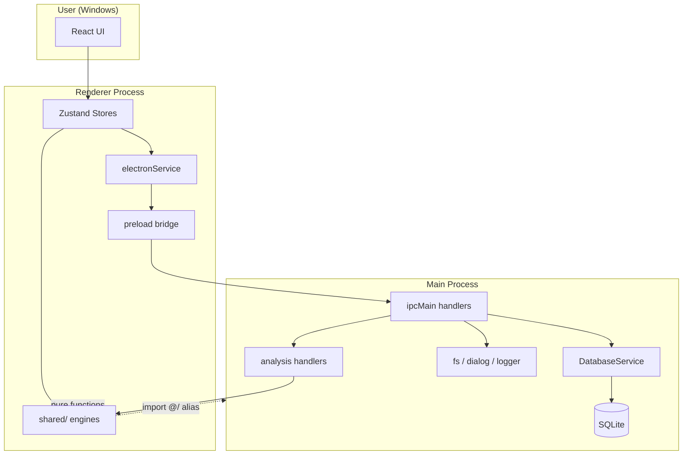
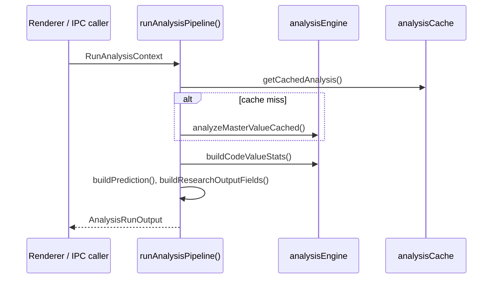
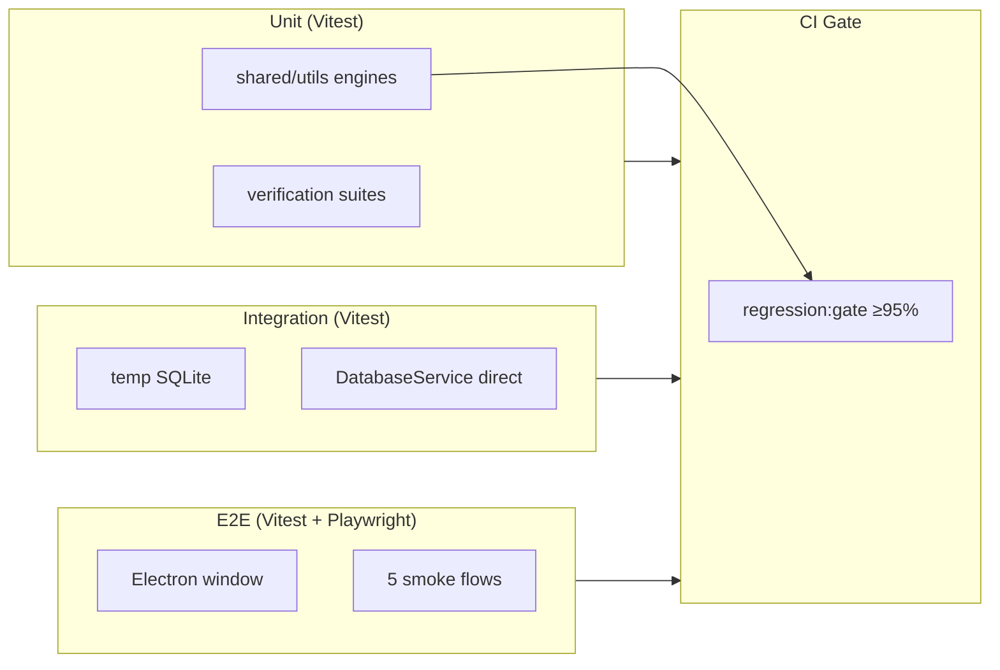

# CS E-Bid Analyzer — Architecture

| 항목 | 내용 |
|------|------|
| **문서 버전** | 1.0.0 (Phase 4-5) |
| **기준일** | 2026-06-30 |
| **상태** | Living document — 구현 기준은 [STATUS.md](./STATUS.md) |

Windows 데스크톱 앱 **CS E-Bid Analyzer**의 소프트웨어 아키텍처를 설명한다.  
제품 요구사항은 [PRD.md](./PRD.md), IPC 채널 상세는 [API.md](./API.md)를 참조한다.

---

## 1. Overview

### 1.1 Purpose

레거시 MFC **전자입찰 누적카운트** 프로그램을 Electron + React + TypeScript로 재구현한다. 핵심 역할:

- **Master(00~99)** · **Code** · **CodeValue** 데이터 CRUD 및 일괄 가져오기
- Master 숫자 시퀀스 **분석 엔진** (STEP1~3, 패턴, CodeValue 통계, 예측)
- **Statistics** · **Analysis History** 집계 및 DB 영속화
- **Research Lab** — 실험·검증·레거시 비교·Test Suite
- **Reverse Engineering** — Master Value 기반 오프라인 분석·내보내기

### 1.2 Technology Stack

| Layer | Technology |
|-------|------------|
| Desktop shell | Electron 36 |
| UI | React 19, React Router 7 (hash), Tailwind CSS |
| Grid / DnD | AG Grid 33, @dnd-kit |
| Forms | react-hook-form |
| State | Zustand 5 |
| DB | SQLite via Prisma 6 |
| Build | Vite 6, vite-plugin-electron, electron-builder |
| Test | Vitest 3, Playwright (Electron E2E) |
| i18n | Custom flat message map (`src/i18n/messages.ts`) |

### 1.3 High-Level System Context



---

## 2. Process Architecture

Electron **2-process** 모델을 따른다. Renderer는 Node/DB에 직접 접근하지 않는다.

| Capability | Main | Renderer | Shared (`src/shared/`) |
|------------|:----:|:--------:|:----------------------:|
| React UI / routing | | ✅ | |
| Zustand state | | ✅ | |
| Prisma / SQLite | ✅ | | |
| Native file dialogs | ✅ | | |
| Filesystem I/O (logs, screenshots, export save) | ✅ | | |
| IPC handler registration | ✅ | | |
| Analysis **orchestration** (DB load → pipeline) | ✅ | | |
| Analysis **computation** (digits, patterns, stats) | | ✅ | ✅ |
| Verification / regression suites | | ✅ (fallback) | ✅ |
| i18n message resolution | | ✅ | ✅ (`translate()`) |

### 2.1 Security Model

- `contextIsolation: true`, `nodeIntegration: false`
- Renderer ↔ Main 통신은 `electron/preload.ts`의 `contextBridge.exposeInMainWorld('electronAPI', …)` 만 허용
- 타입 계약: `src/types/electron.ts` ↔ preload ↔ `electron/main.ts` handlers

### 2.2 Boot Sequence (Main)

```
app.ready
  → ensureUserDataDirectory()
  → DatabaseService.initialize()   // Prisma connect, seed, template DB copy (prod)
  → registerIpcHandlers()          // ~50 ipcMain.handle channels
  → createWindow()                 // preload + dist/index.html or dev URL
```

Shutdown: `databaseService.disconnect()` on `before-quit` /home / `window-all-closed`.

### 2.3 Boot Sequence (Renderer)

```
index.html → src/main.tsx → src/app/App.tsx
  → ErrorBoundary, GlobalBusyOverlay, GlobalConfirmDialog
  → RouterProvider(hash router)
  → MainLayout → useAppInit(), useDbStatusRefresh(), keyboard shortcuts
```

---

## 3. Repository Layout

```
cs_e_bid_program/
├── electron/                 # Main process
│   ├── main.ts               # Window + IPC registration (entry)
│   ├── preload.ts            # contextBridge API
│   ├── database/             # Prisma services, repositories, validation
│   ├── analysis/             # analysis:run / suite IPC handlers
│   └── logger/               # fileLogger → userData/logs/
├── prisma/
│   └── schema.prisma         # SQLite schema
├── src/                      # Renderer + shared (imported by main via @/)
│   ├── app/                  # App shell, router, global stores
│   ├── pages/                # Thin route wrappers → features
│   ├── layouts/              # MainLayout (Toolbar + Sidebar + Outlet)
│   ├── features/             # Feature-sliced modules (see §4)
│   ├── components/           # Cross-feature layout & UI primitives
│   ├── shared/               # Pure engines, verification, fixtures
│   ├── services/             # electronService facade, ipc-guard
│   ├── stores/               # Global persisted UI stores
│   ├── i18n/                 # messages, useI18n, translate()
│   ├── hooks/                # useAppInit, keyboard shortcuts
│   ├── lib/                  # constants, AG Grid setup
│   └── types/                # electron API & domain DTOs
├── tests/
│   ├── shared/               # Unit tests (engines, verification)
│   ├── integration/          # IPC + temp SQLite (no Electron window)
│   └── e2e/                  # Playwright + built dist-electron
├── scripts/                  # regression gate, packaging, catalog import
└── docs/                     # PRD, STATUS, TEST-CATALOG, this file, …
```

**Build outputs:** `dist/` (renderer), `dist-electron/` (main + preload), `release/` (installer).

---

## 4. Renderer Architecture

### 4.1 Routing

- **Router:** `src/app/router.tsx` — `createHashRouter` (Electron `file://` 호환)
- **Routes:** `src/lib/constants.ts` → `APP_ROUTES`

| Path | Page | Feature entry |
|------|------|---------------|
| `/master` | `MasterPage` | `features/master/MasterFeature` |
| `/code` | `CodePage` | `features/code/CodeManagement` |
| `/code-value` | `CodeValuePage` | `features/codeValue/CodeValueFeature` |
| `/reverse-engineering` | `ReverseEngineeringPage` | `features/reverse-engineering/` |
| `/research` | `ResearchPage` | `features/research/ResearchFeature` |
| `/analysis` | `AnalysisPage` | `features/analysis/AnalysisFeature` |
| `/statistics` | `StatisticsPage` | `features/statistics/StatisticsFeature` |
| `/settings` | `SettingsPage` | `features/settings/SettingsFeature` |

Legacy alias: `/algorithm-research` → `/research`.

### 4.2 Feature Module Pattern

각 기능은 `src/features/<name>/` 아래 **수직 슬라이스**로 구성한다.

```
features/<name>/
  <Name>Feature.tsx      # Shell: titlebar, toolbar, panels, statusbar
  components/            # Feature-only UI
  stores/                # Zustand (IPC orchestration, local UI state)
  services/              # Business logic → repositories
  repositories/          # Thin IPC wrappers → electronService
  types/                 # Feature-local types
  utils/                 # Display helpers
  index.ts               # Public exports
```

**Typical data flow (Master CRUD):**

```
MasterFeature
  → useMasterStore
  → masterService
  → masterRepository
  → electronService.masterSave / getAll / …
  → window.electronAPI (preload)
  → ipcMain.handle('master:save', …)
  → MasterService (main) → MasterRepository → Prisma
```

**Non-routed feature:** `features/admin/` — Toolbar에서 호출하는 일괄 Import/Export 모달.

### 4.3 Global vs Feature State (Zustand)

| Store | Location | Responsibility |
|-------|----------|----------------|
| `useAppStore` | `src/app/stores/` | Theme, app version, DB status, busy overlay, system errors |
| `useSettingsStore` | `src/stores/` | Language, refresh interval — **persisted** |
| `useConfirmDialogStore` | `src/stores/` | Global confirm modal (replaces `window.confirm`) |
| `useWorkspaceLayoutStore` | `src/stores/` | Sidebar order, analysis/codeValue panel layout — **persisted** |
| `useMasterStore`, `useCodeStore`, … | `features/*/stores/` | Feature CRUD + status messages |

Store 메시지는 React 밖에서 `translate()` (`src/i18n/translate.ts`), UI는 `useI18n()` hook 사용.

### 4.4 UI Conventions

- **Windows-style chrome:** `win-titlebar`, `win-toolbar`, `win-statusbar`, `win-panel` CSS classes
- **Resizable panels:** `components/layout/ResizableSplitter` + persisted widths
- **Sortable tabs/panels:** `@dnd-kit` via `SortableTabBar`, workspace layout store
- **Grids:** AG Grid with shared perf defaults (`src/lib/ag-grid-performance.ts`)

---

## 5. Main Process Architecture

### 5.1 IPC Registration

모든 채널은 `electron/main.ts`의 `registerIpcHandlers()`에 등록된다. (단일 파일; 도메인 서비스는 모듈화됨.)

**Naming:** `domain:action` 또는 `domain:subdomain:action`

| Namespace | Examples | Delegates to |
|-----------|----------|--------------|
| `db:` | `getStatus`, `backup`, `restore`, `createAnalysisHistory`, `recordMasterStatistics` | `DatabaseService` |
| `master:` | `getAll`, `save`, `delete`, `bulkUpsert`, `validateData` | `MasterService` |
| `code:` | CRUD, `bulkUpsert` | `CodeService` |
| `codeValue:` | CRUD | `CodeValueService` |
| `research:` | experiments, inputs/outputs, hypotheses, verifications, screenshots, `exportAll` | `ResearchService` |
| `analysis:` | `run`, `runRegressionSuite`, `runFullSuite`, `healthCheck` | `electron/analysis/*-handler.ts` |
| `app:` | `getVersion`, `saveTextFile`, `saveBinaryFile`, `verifyPackaging` | Electron APIs |

Progress events (bulk upsert): `master:bulkUpsert:progress`, `code:bulkUpsert:progress` — preload에서 `ipcRenderer.on` + unsubscribe 반환.

> 전체 채널 목록·페이로드: [API.md](./API.md) (Phase 4 잔여).

### 5.2 Database Layer

```
IPC handler
  → DatabaseService (facade)
    → Domain Service (validation + rules)
      → Repository (Prisma CRUD)
        → SQLite file
```

**Key files:**

| File | Role |
|------|------|
| `electron/database/database-service.ts` | Prisma client lifecycle, wires all domain services |
| `electron/database/db-path.ts` | Dev/prod/E2E DB path resolution |
| `electron/database/*/repository.ts` | Prisma queries |
| `electron/database/*/validation-service.ts` | Input validation → `AppErrorCode` |

**DB path policy:**

| Mode | Path |
|------|------|
| Development | `<projectRoot>/prisma/dev.db` |
| Production | `<userData>/database.db` (first run: template from `extraResources`) |
| E2E | `CSEBID_E2E_DB_PATH` env override |

Integration tests use `DatabaseService.initializeAtPath(tempFile)` without Electron.

### 5.3 Analysis IPC Handlers

| Handler | File | Behavior |
|---------|------|----------|
| `analysis:run` | `electron/analysis/analysis-run-handler.ts` | Load master + codes from DB → `runAnalysisPipeline()` |
| `analysis:runRegressionSuite` | `electron/analysis/analysis-suite-handler.ts` | Built-in fixture regression |
| `analysis:runFullSuite` | same | DB verification + experiment suite |
| `analysis:healthCheck` | same | App health report |

Main process는 Master 저장/삭제 시 `invalidateAnalysisCacheForMaster()` 호출 (`src/shared/utils/analysisCache.ts`).

---

## 6. Shared Layer (`src/shared/`)

Main과 Renderer **양쪽에서 import** 가능한 순수(또는 거의 순수) 로직. Vite `@/` alias로 main bundle에도 포함된다.

### 6.1 Analysis Pipeline (Single Source of Truth)



**Entry:** `src/shared/services/analysisRunService.ts`

- `resolveAnalysisContext()` — masterNo / masterValue 정규화
- `runAnalysisPipeline()` — IPC handler와 renderer fallback **동일 경로**

Renderer fallback (IPC 없음): `electronService.runAnalysisLocal()` → 동일 pipeline.

### 6.2 Core Engines

| Module | Path | Responsibility |
|--------|------|----------------|
| Analysis engine | `shared/utils/analysisEngine.ts` | Digit classification, low/high patterns, code matching |
| Statistics engine | `shared/utils/statisticsEngine.ts` | Frequency, ratio, distribution text |
| Prediction engine | `shared/utils/predictionEngine.ts` | Heuristic prediction (⚠️ legacy unverified) |
| Batch analysis | `shared/utils/batchAnalysis.ts` | Master 00–99 sequential run |
| Analysis cache | `shared/utils/analysisCache.ts` | In-memory memoization by masterNo + value hash |
| Persist helper | `shared/utils/persistAnalysisToDb.ts` | History/statistics IPC persist + user notify |

### 6.3 Verification & Quality Gates

| Module | Purpose |
|--------|---------|
| `regressionSuite.ts` | Built-in JSON fixtures (`fixtures/engine-regression-cases.json`) |
| `regressionGate.ts` | CI threshold evaluator (≥95% pass) |
| `verificationSuite.ts` | Full suite over DB verifications |
| `engineVerification.ts` | Single-case engine verification |
| `appHealthCheck.ts` | Settings health check report |
| `analysisDualRun.ts` | IPC vs local pipeline consistency |

**Release gate:** `npm run build:check` includes `regression:gate` → `scripts/run-regression-gate.ts`.

### 6.4 Structured Errors

- `src/shared/errors/app-error-codes.ts` — `AppErrorCode` enum (`VAL_*`, `DB_*`, `IPC_*`, …)
- Main validation / IPC handlers return codes; renderer formats via `src/i18n/format-app-errors.ts`

---

## 7. Data Model

Prisma schema: `prisma/schema.prisma` (SQLite).

### 7.1 Core Domain

| Model | Description |
|-------|-------------|
| `Master` | Slot `masterNo` ('00'~'99'), `masterValue` (digit sequence), `memo` |
| `Code` | Rule registry: `code`, `type` (low/high), `description` |
| `CodeValue` | Auxiliary code/value records for DB-managed CodeValue screen |
| `AnalysisHistory` | Analysis run history rows |
| `Statistics` | Aggregated statistic snapshots |

### 7.2 Research Domain

| Model | Description |
|-------|-------------|
| `Experiment` | Research experiment header (status, version) |
| `ExperimentInput` / `ExperimentOutput` | Key-value experiment I/O |
| `Hypothesis` | Linked or standalone hypotheses |
| `Verification` | Test case with expected/actual/passed |
| `Comparison` | Legacy vs ours diff per field |
| `Screenshot` | File reference under userData |

Research schema upgrades use incremental migration in `electron/database/research/research-schema-migration.ts` — legacy v1 blob rows are preserved on upgrade ([RESEARCH_WORKSPACE.md](./RESEARCH_WORKSPACE.md) §8).

### 7.3 Domain ↔ UI Mapping

| DB field | UI label (typical) |
|----------|-------------------|
| `Master.masterValue` | 입력 값 |
| `Code.code` | 코드명 |
| `Code.type` | 구분 (저점/고점) |

---

## 8. Renderer ↔ Main Communication

### 8.1 Facade Pattern

`src/services/electron-service.ts` — single class wrapping `window.electronAPI`:

- Typed methods per domain (`getAllMasters`, `runAnalysis`, `researchSaveExperiment`, …)
- `withIpcGuard()` — 30s timeout, errors → `useAppStore` + `formatAppErrors`
- Local fallbacks when `electronAPI` absent (unit tests, degraded mode)

### 8.2 IPC Guard

`src/services/ipc-guard.ts`:

- Wraps promise-based IPC calls
- Surfaces timeout / IPC failures to global error UI
- Prevents hung UI on main-process blocking

### 8.3 Bulk Operation Progress

Preload exposes listener helpers; renderer subscribes during `bulkUpsert` operations for progress bars.

---

## 9. Internationalization (i18n)

| Piece | Location | Usage |
|-------|----------|-------|
| Message catalog | `src/i18n/messages.ts` | `{ ko: {...}, en: {...} }`, type `MessageKey` |
| React hook | `src/i18n/use-i18n.ts` | `t('namespace.key', { param })` |
| Store/service | `src/i18n/translate.ts` | Same API outside React |
| Language setting | `useSettingsStore.language` | Persisted in localStorage |
| Error formatting | `src/i18n/format-app-errors.ts` | Maps `AppErrorCode[]` → localized string |

No ICU / react-i18next — simple `{param}` string replacement.

Coverage ~88% ([STATUS.md](./STATUS.md)); Settings, Admin Import, Program Info 등 잔여.

---

## 10. Testing Architecture



| Layer | Location | Command | Notes |
|-------|----------|---------|-------|
| Unit | `tests/shared/**`, `tests/features/**`, `tests/hooks/**` | `npm run test:unit` | Node env, no Electron |
| Integration | `tests/integration/ipc-database.integration.test.ts` | `npm run test:integration` | Real SQLite, 19 tests |
| E2E | `tests/e2e/smoke.e2e.test.ts` | `npm run test:e2e` | Requires `npm run build` first |
| Coverage | vitest thresholds | `npm run test:coverage` | Focus: `src/shared`, `electron` |
| Regression gate | `scripts/run-regression-gate.ts` | `npm run regression:gate` | Blocks `build:check` if <95% |

**CI:** `.github/workflows/ci.yml` — lint, unit, integration, regression, build, E2E on `windows-latest`.

---

## 11. Build & Release Pipeline

### 11.1 Development

```bash
npm run dev
# Vite :5173 + vite-plugin-electron compiles electron/ → dist-electron/
```

### 11.2 Production Build

```
npm run build:prod:nsis
  ├─ build:check
  │    ├─ lint (eslint src · tests · electron)
  │    ├─ test (unit + integration)
  │    ├─ regression:gate
  │    └─ tsc && vite build → dist/ + dist-electron/
  ├─ prepare:packaging (scripts/prepare-packaging.mjs)
  │    ├─ prisma generate
  │    └─ template dev.db for first-run copy
  └─ electron-builder --win --x64 → release/
```

**Packaging notes (`package.json` `build`):**

- ASAR with unpacked Prisma query engine (`.node`)
- `extraResources`: template `database.db`, generated Prisma client
- Targets: NSIS installer (default), portable variant via `build:prod:portable`

### 11.3 Vite Configuration Highlights

- `@` → `./src` alias (renderer + electron main sub-build)
- Main process externalizes `@prisma/client`
- Manual chunk: `xlsx` (large dependency)

---

## 12. Key Design Decisions

| Decision | Rationale | Trade-off |
|----------|-----------|-----------|
| Hash router | Works with Electron `file://` without server-side routing | URLs include `#` |
| Monolithic IPC registration in `main.ts` | Simple discovery; handlers delegate to services | Large main file (~500 lines) |
| Shared `runAnalysisPipeline()` | IPC and renderer stay behavior-identical | Shared code bundled in both processes |
| Feature-sliced frontend | Aligns with screen-based PRD; isolates stores/services | Some cross-feature duplication (e.g. master list grids) |
| Repository pattern on **both** sides | Renderer repos mirror main; clear test seams | Extra indirection vs direct `electronService` |
| Flat i18n map | No runtime dependency; easy grep for keys | No pluralization / ICU |
| SQLite + Prisma | Single-file DB, easy backup/restore, desktop-friendly | Research legacy migration tested via integration suite |
| Regression gate in `build:check` | Prevents engine regressions reaching release | CI time + fixture maintenance |
| `ConfirmDialog` global store | Consistent UX; replaces blocking `window.confirm` | Async confirm flow in stores |
| In-memory analysis cache | Avoids recomputation on tab switches | Must invalidate on master writes (main responsibility) |

---

## 13. Algorithm Verification Status

엔진 아키텍처와 **검증 상태**는 분리해서 본다.

| Area | Engine location | Verification |
|------|-----------------|--------------|
| STEP2/3, Statistics | `analysisEngine`, `statisticsEngine` | Built-in regression **18/18 @100%** |
| CodeValue stats | `buildCodeValueStats` | SRC-BUILTIN 12/12; **legacy unverified** |
| Prediction | `predictionEngine` | Heuristic; **legacy unverified** |
| Legacy catalog | TEST-CATALOG | **0/100 SRC-LEGACY verified** (100 DRAFT skeleton) |

상세: [TEST-CATALOG.md](./TEST-CATALOG.md), [RE-PLAYBOOK.md](./RE-PLAYBOOK.md).

---

## 14. Related Documents

| Document | Relationship |
|----------|--------------|
| [PRD.md](./PRD.md) | Product requirements, screen specs |
| [STATUS.md](./STATUS.md) | **Implementation truth** — what is done vs partial |
| [DEFINITION_OF_DONE.md](./DEFINITION_OF_DONE.md) | Phase completion gates |
| [API.md](./API.md) | IPC channel catalog (planned) |
| [TEST-CATALOG.md](./TEST-CATALOG.md) | Verification case index |
| [RE-PLAYBOOK.md](./RE-PLAYBOOK.md) | Legacy → verification workflow |
| [RESEARCH_WORKSPACE.md](./RESEARCH_WORKSPACE.md) | Research outputs Policy B |
| [INSTALL-QA-CHECKLIST.md](./INSTALL-QA-CHECKLIST.md) | Release QA |

---

## 15. Extension Guidelines

새 기능 추가 시 권장 순서:

1. **Domain** — Prisma model (if persisted) + validation service + repository (main)
2. **IPC** — handler in `main.ts`, expose in `preload.ts`, type in `electron.ts`
3. **Facade** — method on `electronService` with `withIpcGuard`
4. **Feature** — store → service → components under `src/features/<name>/`
5. **i18n** — add keys to `messages.ts` (ko + en)
6. **Tests** — unit for pure logic; integration for DB; E2E only for critical smoke paths
7. **Docs** — update [STATUS.md](./STATUS.md); API.md when IPC added

**Pure computation** belongs in `src/shared/` — never duplicate engine logic in main-only or renderer-only modules.

---

*Maintainers: update when process boundaries, IPC namespaces, or shared pipeline contracts change.*
