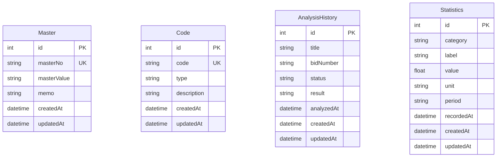
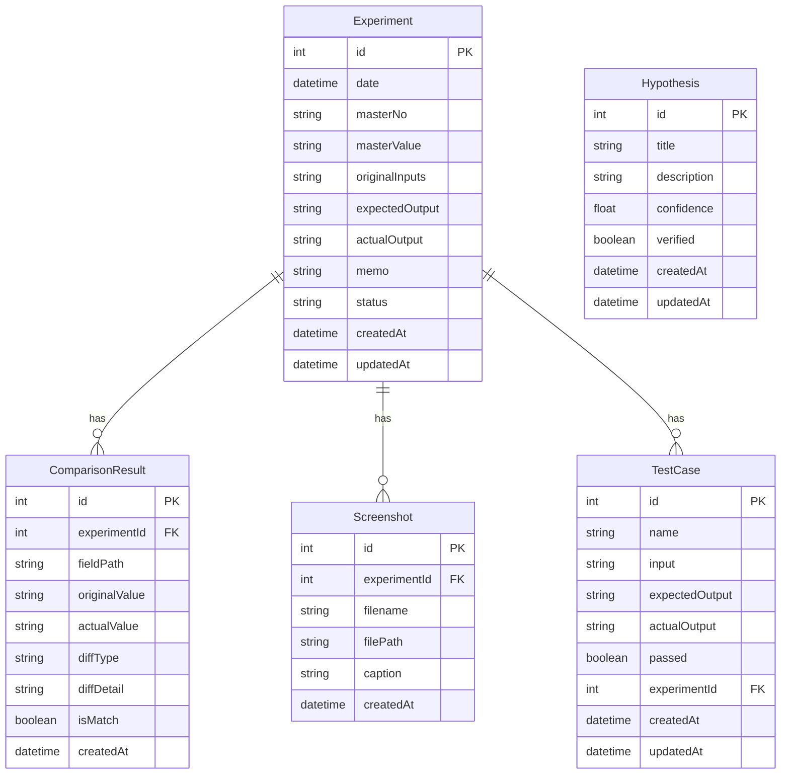
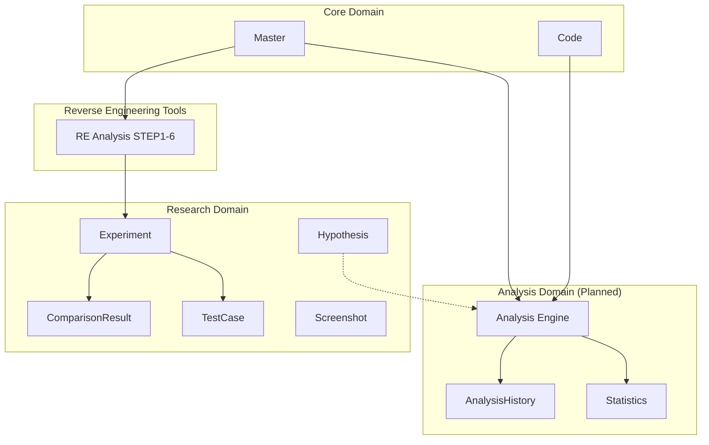

# CS E-Bid Analyzer — Product Requirements Document (PRD)

| 항목 | 내용 |
|------|------|
| **문서명** | CS E-Bid Analyzer PRD |
| **버전** | 1.0.0 |
| **작성일** | 2026-06-29 |
| **최종 동기화** | 2026-06-30 — **Release 1.0.0** ([STATUS.md](./STATUS.md) v1.7.0 · [RELEASE-1.0.0-SIGNOFF.md](./RELEASE-1.0.0-SIGNOFF.md)) |
| **상태** | Active — [STATUS.md](./STATUS.md)가 구현 현황의 기준 문서 |
| **대상 플랫폼** | Windows Desktop (Electron) |
| **제품명** | CS E-Bid Analyzer (전자입찰 분석 프로그램) |

---

## 목차

1. [프로젝트 목적](#1-프로젝트-목적)
2. [개발 목표](#2-개발-목표)
3. [범위 (Scope)](#3-범위-scope)
4. [제외 범위 (Out of Scope)](#4-제외-범위-out-of-scope)
5. [전체 화면 목록](#5-전체-화면-목록)
6. [각 화면의 기능](#6-각-화면의-기능)
7. [메뉴 구조](#7-메뉴-구조)
8. [DB 구조](#8-db-구조)
9. [Entity Diagram](#9-entity-diagram)
10. [각 Entity 설명](#10-각-entity-설명)
11. [프로그램 흐름](#11-프로그램-흐름)
12. [사용자 흐름 (User Flow)](#12-사용자-흐름-user-flow)
13. [기능 목록 (Function List)](#13-기능-목록-function-list)
14. [우선순위 (P0 / P1 / P2)](#14-우선순위-p0--p1--p2)
15. [API 목록](#15-api-목록)
16. [Service 구조](#16-service-구조)
17. [폴더 구조](#17-폴더-구조)
18. [테스트 전략](#18-테스트-전략)
19. [예외 처리 정책](#19-예외-처리-정책)
20. [로그 정책](#20-로그-정책)
21. [에러 정책](#21-에러-정책)
22. [코딩 컨벤션](#22-코딩-컨벤션)
23. [Git 전략](#23-git-전략)
24. [브랜치 전략](#24-브랜치-전략)
25. [Commit 규칙](#25-commit-규칙)
26. [Cursor AI 개발 규칙](#26-cursor-ai-개발-규칙)
27. [SOLID 적용 기준](#27-solid-적용-기준)
28. [Repository Pattern 적용 기준](#28-repository-pattern-적용-기준)
29. [Naming Convention](#29-naming-convention)
30. [향후 확장 계획](#30-향후-확장-계획)

---

## 1. 프로젝트 목적

### 1.1 배경

기존 Windows MFC 기반 **전자입찰 분석 프로그램(Legacy Program)** 은 입찰 분석에 필요한 Master 데이터, Code 패턴, 분석 알고리즘, 통계 기능을 제공한다. 해당 프로그램은 장기간 운영되어 왔으나 다음과 같은 한계가 있다.

- 레거시 기술 스택(MFC/C++)으로 인한 유지보수 어려움
- 코드베이스 노후화 및 문서 부재
- 신규 기능 추가 및 테스트 자동화의 어려움
- 운영체제 및 배포 환경 변화에 대한 대응 한계

### 1.2 프로젝트 목적

본 프로젝트(**CS E-Bid Analyzer**)는 레거시 전자입찰 분석 프로그램과 **기능적으로 동등(Full Functional Parity)** 한 새로운 Windows Desktop 애플리케이션을 개발하는 것을 목적으로 한다.

**핵심 원칙:**

| 원칙 | 설명 |
|------|------|
| **기능 동등성** | 레거시 프로그램이 수행하는 모든 분석·관리 기능을 동일하게 제공 |
| **코드 신규 작성** | 레거시 소스 코드는 **절대 참고·복사하지 않음** |
| **UI 참고 허용** | 레거시 UI 레이아웃·화면 구성·Windows Desktop UX는 참고 가능 |
| **역분석 우선** | 분석 알고리즘은 추측하지 않고, 관측·실험·검증 후 구현 |
| **현대적 아키텍처** | 유지보수·테스트·확장이 용이한 구조로 재설계 |

### 1.3 이해관계자

| 역할 | 책임 |
|------|------|
| **Product Owner** | 기능 범위·우선순위 결정, 레거시 프로그램 기준 승인 |
| **Reverse Engineering Engineer** | 레거시 프로그램 관측, 실험 설계, 가설 수립·검증 |
| **Developer** | PRD 기준 기능 구현, 테스트 작성 |
| **QA** | Test Case 기반 검증, Pass/Fail 확인 |
| **End User** | Master/Code 관리, 입찰 분석 실행, 통계 조회 |

### 1.4 성공 기준 (Success Criteria)

1. 레거시 프로그램의 Master(00~99), Code, Analysis, Statistics 핵심 기능 100% 재현
2. Algorithm Research Test Case **Pass Rate ≥ 95%** (검증 완료 알고리즘 기준)
3. Windows 10/11에서 NSIS 인스톨러로 정상 설치·실행
4. SQLite 로컬 DB 자동 생성 및 데이터 영속성 보장
5. 레거시 UI와 유사한 Windows Desktop UX 제공

---

## 2. 개발 목표

### 2.1 기술 목표

| # | 목표 | 측정 기준 |
|---|------|-----------|
| T1 | Electron + React + TypeScript 기반 Desktop App | 빌드·실행 성공 |
| T2 | Feature-Based Architecture | 기능별 독립 모듈 분리 |
| T3 | Prisma ORM + SQLite | 스키마 마이그레이션·CRUD 정상 |
| T4 | IPC 기반 Main/Renderer 분리 | DB 접근 Main Process 한정 |
| T5 | AG Grid 기반 데이터 그리드 | Master/Code/Analysis 목록 표시 |
| T6 | Dark/Light Mode | CSS 변수 기반 테마 전환 |
| T7 | ESLint + Prettier + Path Alias | CI lint 통과 |

### 2.2 비즈니스 목표

| # | 목표 |
|---|------|
| B1 | Master 데이터 00~99 완전 관리 |
| B2 | Code 패턴 코드 CRUD 및 검색 |
| B3 | 입찰 분석 엔진 (레거시 동등) 구현 |
| B4 | 분석 이력 및 통계 제공 |
| B5 | 역분석 실험실을 통한 알고리즘 검증 체계 구축 |

### 2.3 품질 목표

- **정확성**: 레거시 프로그램 Output과의 일치 (Test Case Pass)
- **안정성**: DB 손상 없이 CRUD 반복 수행
- **유지보수성**: SOLID, Repository Pattern, Feature 분리
- **추적성**: Experiment/Hypothesis/TestCase로 알고리즘 결정 이력 추적

### 2.4 개발 방법론

```
실험 (Experiment)
    ↓  레거시 프로그램 Input/Output 기록
비교 (Comparison)
    ↓  Expected vs Actual Diff
가설 (Hypothesis)
    ↓  관찰 기반 가설 문서화
검증 (Verification / TestCase)
    ↓  Pass/Fail 자동 판정
구현 (Implementation)
    ↓  Pass된 Test Case만 코드화
```

**절대 금지:** 알고리즘 추측 구현, Code Value 임의 계산, Prediction 임의 생성

---

## 3. 범위 (Scope)

### 3.1 In Scope — Phase 1 (현재~P0)

| 영역 | 내용 | 상태 |
|------|------|------|
| **프로젝트 스캐폴딩** | Electron + React + Vite + TypeScript | ✅ 완료 |
| **공통 UI** | Sidebar, Toolbar, StatusBar, MainLayout | ✅ 완료 |
| **MASTER** | 00~99 CRUD, Validation, AG Grid | ✅ 완료 |
| **CODE** | Code CRUD, 검색, AG Grid | ✅ 완료 |
| **Reverse Engineering** | Master Value 구조 분석 STEP1~6 | ✅ 완료 |
| **Algorithm Research** | Experiment, Hypothesis, Comparison, TestCase, Screenshot | ✅ 완료 |
| **Settings** | DB 백업/복원, 헬스체크, 패키징 확인, 테마·언어 | ✅ 완료 |
| **DB** | SQLite 자동 생성, Prisma Schema | ✅ 완료 |
| **Admin** | Master/Code CSV·Excel 일괄 Import | ✅ 완료 |

### 3.2 In Scope — Phase 2 (P0) — Analysis & Statistics

| 영역 | 내용 | 상태 (Release 1.0) |
|------|------|-------------------|
| **Analysis Engine** | STEP2/3, Statistics, Prediction, CodeValue stats | 🔶 STEP2/3·Statistics ✅; Prediction·CodeValue ⚠️ legacy 미검증 |
| **Code Value UI** | `/code-value` 분석·DB 관리 | ✅ UI; 알고리즘 ⚠️ |
| **Statistics** | Frequency, Low/High, Distribution + charts | ✅ |
| **Analysis History** | DB 저장, 이력 패널 | ✅ (persist 실패 시 StatusBar 알림) |
| **레거시 UI 정합** | MFC 스타일 세부 UI | 🔶 Menu Edit = sidebar reorder only |

> 상세: [STATUS.md](./STATUS.md) §2–§3

### 3.2a (구 §3.2) — 원 P0 Analysis 범위 (참고)

| 영역 | 내용 |
|------|------|
| **Analysis Engine** | 레거시 동등 입찰 분석 (Master + Code + Code Value → STEP2/3/Statistics/Prediction) |
| **Code Value** | Code 기반 Value 계산 (역분석 검증 후) |
| **Statistics** | 분석 통계 대시보드 |
| **Analysis History** | 분석 이력 CRUD 및 재실행 |
| **레거시 UI 정합** | MFC 스타일 세부 UI (Code Value, Menu Edit, Program Info) |

### 3.3 In Scope — Phase 3 (P1)

| 영역 | 내용 | 상태 (Release 1.0) |
|------|------|-------------------|
| **Excel Import/Export** | Master, Code 일괄 가져오기/내보내기 | ✅ |
| **Windows NSIS Installer** | 프로덕션 배포 | 🔶 `build:prod:nsis` ✅; 수동 install QA 잔여 |
| **DB Backup/Restore** | Settings에서 DB 백업·복원 | ✅ |
| **키보드 단축키** | F2, Ctrl+S, Delete, Alt+1–8, Ctrl+Shift+I | ✅ |
| **로그 파일** | Main Process 파일 로그 | ✅ |
| **통합/E2E 테스트** | IPC + SQLite integration, Playwright smoke | ✅ 21 integration + 5 E2E |

### 3.4 In Scope — Phase 4 (P2) & Phase 5

| 영역 | 내용 | 상태 (Release 1.0) |
|------|------|-------------------|
| **다중 Master 일괄 분석** | 00~99 배치 분석 | ✅ |
| **실험 대시보드** | Algorithm Research 통계·트렌드 | ✅ |
| **가설-코드 추적** | Hypothesis ↔ Source / Experiment 링크 | ✅ |
| **Statistics 차트** | Distribution, Low/High, Frequency | ✅ |
| **i18n** | `messages.ts` ko/en (≥90% UI) | ✅ ~92% |
| **ARCHITECTURE / API 문서** | 시스템·IPC 레퍼런스 | ✅ |
| **Route code splitting** | Lazy routes, vendor chunks | ✅ |
| **Analysis Web Worker** | 대용량 masterValue (≥500 digits) | ✅ Settings toggle |
| **Research DB migration** | Incremental schema (no drop/recreate) | ✅ |
| **자동 스크린샷** | 레거시 프로그램 연동 캡처 (선택) | ❌ P2-05 deferred |

### 3.5 Release 1.0.0 Summary

| 항목 | 내용 |
|------|------|
| **버전** | `1.0.0` (`package.json`) |
| **빌드 게이트** | `npm run build:check` — lint + **148 tests** + `regression:gate` + build |
| **패키징** | `npm run build:prod:nsis` → `release/CS E-Bid Analyzer-Setup-1.0.0-x64.exe` |
| **검증 게이트** | Built-in regression **18/18 @100%** · combined diagnose **43/43 @100%** |
| **Deferrals** | P0-13 SRC-LEGACY catalog → v1.1 · NSIS manual QA · PO Prediction/CodeValue sign-off |

> Gate audit: [RELEASE-1.0.0-SIGNOFF.md](./RELEASE-1.0.0-SIGNOFF.md) · Live status: [STATUS.md](./STATUS.md)

---

## 4. 제외 범위 (Out of Scope)

### 4.1 명시적 제외

| # | 제외 항목 | 사유 |
|---|-----------|------|
| O1 | 레거시 C++/MFC 소스 코드 참조·포팅 | PRD 핵심 원칙 |
| O2 | 알고리즘 추측 기반 구현 | Reverse Engineering 원칙 |
| O3 | Web / Mobile 버전 | Desktop 전용 |
| O4 | 클라우드 DB / 멀티유저 | 로컬 SQLite 단일 사용자 |
| O5 | 반응형(Responsive) UI | Windows Desktop 고정 레이아웃 |
| O6 | 실시간 입찰 API 연동 | 분석 도구 범위 외 |
| O7 | AI/ML 기반 예측 | 레거시 알고리즘 재현만 대상 |
| O8 | Linux / macOS 지원 | Windows 우선 (P2 이후 검토) |

### 4.2 현재 버전에서 제외 (v1.0 이후)

- macOS / Linux 포트 (P2-07)
- Menu Edit **전체** 레거시 메뉴 구조 편집 (v1.0 = **사이드바 순서 변경만** ✅)
- Research **자동 스크린샷** (P2-05)
- P0-13 **SRC-LEGACY** full catalog (100건 관측 데이터 — v1.1)

**v1.0.0에 포함됨:** Analysis Main IPC, Statistics 실데이터·차트, Research Dashboard, Hypothesis link, E2E/IPC integration tests, i18n ≥90%, `ARCHITECTURE.md` / `API.md` / published `CHANGELOG` — [STATUS.md](./STATUS.md) 참조.

---

## 5. 전체 화면 목록

### 5.1 애플리케이션 Shell

| ID | 화면명 | Route | 설명 |
|----|--------|-------|------|
| S01 | Main Layout | `/` | Sidebar + Toolbar + Content + StatusBar |
| S02 | Toolbar | (공통) | 앱 이름, 버전, DB 상태, 테마 전환 |
| S03 | Sidebar | (공통) | 좌측 네비게이션 메뉴 |
| S04 | StatusBar | (공통) | 하단 상태 메시지 (기능별 StatusBar 포함) |

### 5.2 비즈니스 화면

| ID | 화면명 | Route | 레거시 대응 | 구현 상태 |
|----|--------|-------|-------------|-----------|
| B01 | MASTER | `/master` | 마스터 데이터 입력 (00~99) | ✅ |
| B02 | CODE | `/code` | Code 관리 | ✅ |
| B03 | Reverse Engineering | `/reverse-engineering` | (신규) Master 구조 분석 | ✅ |
| B04 | Algorithm Research | `/research` (alias `/algorithm-research`) | (신규) 역분석 실험실 | ✅ |
| B05 | Analysis | `/analysis` | 입찰 분석 실행·이력 | ✅ (Prediction ⚠️) |
| B06 | Statistics | `/statistics` | 통계 대시보드 | ✅ |
| B07 | Settings | `/settings` | 프로그램 설정 | ✅ |
| B08 | Code Value | `/code-value` | 페이지별 코드카운트 | 🔶 (알고리즘 ⚠️) |

### 5.3 레거시 참고 화면

| ID | 화면명 | Route / 위치 | 상태 (Release 1.0) |
|----|--------|--------------|-------------------|
| L01 | Code Value | `/code-value` | 🔶 UI ✅, 알고리즘 ⚠️ |
| L02 | Menu Edit | Sidebar drag reorder | ✅ v1.0 scope |
| L03 | Program Info | Toolbar modal | ✅ |
| L04 | Analysis Execute | `/analysis` | ✅ |
| L05 | Analysis Result | Analysis panels | ✅ (Prediction ⚠️) |

### 5.4 Algorithm Research 서브 화면

| ID | 화면명 | Tab | 설명 |
|----|--------|-----|------|
| R01 | Experiments | experiments | 실험 CRUD, 입력/출력, 비교, Screenshot |
| R02 | Hypotheses | hypotheses | 가설 CRUD |
| R03 | Test Cases | testCases | 테스트 케이스 Pass/Fail |

---

## 6. 각 화면의 기능

### 6.1 MASTER (B01)

**목적:** 입찰 분석에 사용되는 Master 데이터(00~99)를 등록·수정·삭제·조회한다.

**레이아웃 (레거시 참고):**

```
┌─────────────────────────────────────────────────────────┐
│ Toolbar: 신규 | 저장 | 삭제 | 검증(Data Validation)      │
├──────────────┬──────────────────────────────────────────┤
│ Master Grid  │ MasterEditor                             │
│ (00~99)      │ ┌ ComboBox: Master No ─────────────────┐ │
│ AG Grid      │ │ TextArea: Master Value (Monospace)   │ │
│              │ │ (1000자, 줄바꿈 OFF)                  │ │
│              │ ├ Memo ────────────────────────────────┤ │
│              │ └ Buttons ─────────────────────────────┘ │
├──────────────┴──────────────────────────────────────────┤
│ StatusBar: 레코드 카운트, 선택 Master, 수정 상태          │
└─────────────────────────────────────────────────────────┘
```

**기능 상세:**

| 기능 | 설명 | Validation |
|------|------|------------|
| Master 목록 | 00~99 슬롯 AG Grid, 선택 Row 강조 | — |
| Master 선택 | Grid 클릭 또는 ComboBox | 00~99 |
| Master Value 입력 | Monospace, MultiLine, max 1000자 | 숫자만, 공백 제거 |
| Memo 입력 | 비고 | 제한 없음 |
| 신규 | 선택 슬롯에 신규 레코드 | masterNo 중복 금지 |
| 저장 | SQLite 저장 | Validation 통과 필수 |
| 삭제 | 선택 Master DB 삭제 | id 존재 필수 |
| 검증 | 숫자/길이/빈값 검사 (알고리즘 아님) | — |
| Resizable Splitter | Grid ↔ Editor 크기 조절 | — |

### 6.2 CODE (B02)

**목적:** 분석 엔진에서 사용할 패턴 Code 문자열을 관리한다.

**레이아웃:**

```
┌─────────────────────────────────────────────────────────┐
│ Search: 코드명 | 설명  |  신규입력 | 저장 | 삭제 | 새로고침 │
├──────────────┬──────────────────────────────────────────┤
│ Code Grid    │ Code Editor                              │
│ AG Grid      │ Code, Type, Description                │
├──────────────┴──────────────────────────────────────────┤
│ StatusBar                                               │
└─────────────────────────────────────────────────────────┘
```

**기능 상세:**

| 기능 | 설명 | Validation |
|------|------|------------|
| 코드명 검색 | 부분 검색, 즉시 Grid 갱신 | — |
| 설명 검색 | 부분 검색 | — |
| CRUD | Code, Type, Description | code 필수·중복금지, type 필수 |
| Code 저장 | 문자열 그대로 저장 (의미 해석 없음) | — |

**초기 시드 Code:** `01, 01234, 10, 20, 23, 234, 23401, 24, 30, 32, 324, 34, 40, 42, 423, 43, 45`

### 6.3 Reverse Engineering (B03)

**목적:** Master Value의 **구조적 특성**을 분석한다. 입찰 알고리즘이 아닌 데이터 분석 도구.

**레이아웃:**

```
┌──────────┬─────────────────┬──────────────────────────┐
│ Master   │ Master Value    │ Analysis Panel           │
│ List     │ (ReadOnly)      │ STEP1: Frequency         │
│ 00~99    │ Monospace       │ STEP2: Low Part (0~4)    │
│          │                 │ STEP3: High Part (5~9)   │
│          │                 │ STEP4: Consecutive Groups│
│          │                 │ STEP5: RLE               │
│          │                 │ STEP6: JSON              │
├──────────┴─────────────────┴──────────────────────────┤
│ Export: Copy JSON | Export JSON/TXT/CSV               │
└───────────────────────────────────────────────────────┘
```

**STEP1 출력:** 전체 길이, 0~9 빈도, 중복 개수, 연속 숫자 개수, 짝수/홀수, 저점(0~4)/고점(5~9), 비율

### 6.4 Algorithm Research (B04)

**목적:** 레거시 프로그램 역분석을 위한 실험실. 알고리즘 구현이 아닌 **관측·비교·가설·검증** 인프라.

**기능:**

| # | 기능 | 설명 |
|---|------|------|
| 1 | 원본 입력 저장 | Master Value, Code, Code Value, STEP2/3, Statistics, Prediction |
| 2 | 실험 기록 | Experiment CRUD (expectedOutput, actualOutput) |
| 3 | 가설 저장 | Hypothesis (title, description, confidence, verified) |
| 4 | 비교 | Expected(좌) vs Actual(우), 일치=초록, 불일치=빨강 |
| 5 | 차이 분석 | Digit Missing, Extra Digit, Character Mismatch + Index |
| 6 | Test Case | Input/Expected/Actual, Pass/Fail 자동 |
| 7 | Screenshot | 원본 프로그램 캡처, Experiment 연결 |
| 8 | JSON Export | 전체 연구 데이터 Export |

### 6.5 Analysis (B05) — Planned

**목적:** Master + Code (+ Code Value) 입력 후 입찰 분석 실행.

**예상 출력 (레거시 기준, 검증 후 구현):**

| 출력 | 설명 |
|------|------|
| STEP2 | Master 기반 2단계 결과 |
| STEP3 | Master 기반 3단계 결과 |
| Statistics | 분석 통계 |
| Prediction | 예측값 |

### 6.6 Statistics (B06) — Planned

**목적:** 분석 결과 집계, 기간별 통계, AG Grid + Summary Card.

### 6.7 Settings (B07)

**목적:** 테마, 언어, DB 경로, 자동 갱신, DB Backup/Restore (P1).

---

## 7. 메뉴 구조

### 7.1 Sidebar Navigation (현재)

```
Menu
├── MASTER
├── CODE
├── Reverse Engineering
├── Algorithm Research
├── Analysis
├── Statistics
└── Settings
```

### 7.2 레거시 Toolbar 참고 (향후)

```
[ MASTER ] [ CODE ] [ Code Value ] [ Menu Edit ] [ Program Info ]
```

### 7.3 메뉴 ↔ Route 매핑

| Menu Label | Route | Feature Module |
|------------|-------|----------------|
| MASTER | `/master` | `features/master` |
| CODE | `/code` | `features/code` |
| Reverse Engineering | `/reverse-engineering` | `features/reverse-engineering` |
| Algorithm Research | `/algorithm-research` | `features/algorithm-research` |
| Analysis | `/analysis` | `features/analysis` |
| Statistics | `/statistics` | `features/statistics` |
| Settings | `/settings` | `features/settings` |

### 7.4 Default Route

- 앱 시작 시 `/master` 로 Redirect

---

## 8. DB 구조

### 8.1 Database Engine

| 항목 | 값 |
|------|-----|
| Engine | SQLite 3 |
| ORM | Prisma 6.x |
| Dev DB | `prisma/dev.db` |
| Production DB | `%APPDATA%/cs-e-bid-program/database/cs_e_bid.db` |
| 자동 생성 | 앱 최초 실행 시 Main Process에서 Schema + Seed |

### 8.2 테이블 목록

| # | Table | Domain | 설명 |
|---|-------|--------|------|
| 1 | Master | Core | Master 00~99 데이터 |
| 2 | Code | Core | 패턴 Code |
| 3 | AnalysisHistory | Analysis | 분석 이력 |
| 4 | Statistics | Analysis | 통계 스냅샷 |
| 5 | Experiment | Research | 역분석 실험 |
| 6 | Hypothesis | Research | 알고리즘 가설 |
| 7 | ComparisonResult | Research | 필드별 Diff 결과 |
| 8 | Screenshot | Research | 실험 스크린샷 |
| 9 | TestCase | Research | 검증 테스트 케이스 |

### 8.3 Prisma Schema (요약)

```prisma
model Master {
  id          Int      @id @default(autoincrement())
  masterNo    String   @unique      // "00" ~ "99"
  masterValue String   @default("")
  memo        String?
  createdAt   DateTime @default(now())
  updatedAt   DateTime @updatedAt
}

model Code {
  id          Int      @id @default(autoincrement())
  code        String   @unique
  type        String
  description String   @default("")
  createdAt   DateTime @default(now())
  updatedAt   DateTime @updatedAt
}

model AnalysisHistory {
  id         Int      @id @default(autoincrement())
  title      String
  bidNumber  String?
  status     String   @default("pending")
  result     String?
  analyzedAt DateTime @default(now())
  createdAt  DateTime @default(now())
  updatedAt  DateTime @updatedAt
}

model Statistics {
  id         Int      @id @default(autoincrement())
  category   String
  label      String
  value      Float
  unit       String?
  period     String?
  recordedAt DateTime @default(now())
  createdAt  DateTime @default(now())
  updatedAt  DateTime @updatedAt
}

model Experiment {
  id             Int                @id @default(autoincrement())
  date           DateTime           @default(now())
  masterNo       String?
  masterValue    String?
  originalInputs String             @default("{}")
  expectedOutput String             @default("{}")
  actualOutput   String             @default("{}")
  memo           String?
  status         String             @default("pending")
  createdAt      DateTime           @default(now())
  updatedAt      DateTime           @updatedAt
  comparisons    ComparisonResult[]
  screenshots    Screenshot[]
  testCases      TestCase[]
}

model Hypothesis {
  id          Int      @id @default(autoincrement())
  title       String
  description String
  confidence  Float    @default(0)
  verified    Boolean  @default(false)
  createdAt   DateTime @default(now())
  updatedAt   DateTime @updatedAt
}

model ComparisonResult {
  id            Int        @id @default(autoincrement())
  experimentId  Int
  fieldPath     String
  originalValue String
  actualValue   String
  diffType      String?
  diffDetail    String?
  isMatch       Boolean
  createdAt     DateTime   @default(now())
  experiment    Experiment @relation(...)
}

model Screenshot {
  id           Int        @id @default(autoincrement())
  experimentId Int
  filename     String
  filePath     String
  caption      String?
  createdAt    DateTime   @default(now())
  experiment   Experiment @relation(...)
}

model TestCase {
  id             Int         @id @default(autoincrement())
  name           String
  input          String
  expectedOutput String
  actualOutput   String?
  passed         Boolean?
  experimentId   Int?
  createdAt      DateTime    @default(now())
  updatedAt      DateTime    @updatedAt
  experiment     Experiment? @relation(...)
}
```

### 8.4 JSON Field 규격 (Experiment)

**originalInputs:**

```json
{
  "masterValue": "1234567890...",
  "code": "01",
  "codeValue": "...",
  "step2": "...",
  "step3": "...",
  "statistics": "...",
  "prediction": "..."
}
```

**expectedOutput / actualOutput:**

```json
{
  "masterValue": "",
  "code": "",
  "codeValue": "",
  "step2": "01234",
  "step3": "56789",
  "statistics": "...",
  "prediction": "..."
}
```

### 8.5 인덱스 정책

| Table | Index | Type |
|-------|-------|------|
| Master | masterNo | UNIQUE |
| Code | code | UNIQUE |
| ComparisonResult | experimentId | FK Index |
| Screenshot | experimentId | FK Index |
| TestCase | experimentId | FK (nullable) |

---

## 9. Entity Diagram

### 9.1 Core Domain



### 9.2 Research Domain



### 9.3 Conceptual Domain Map



---

## 10. 각 Entity 설명

### 10.1 Master

| 항목 | 내용 |
|------|------|
| **역할** | 입찰 분석의 기본 입력 데이터. 번호 00~99 각각에 최대 1000자리 숫자열 저장 |
| **masterNo** | 2자리 문자열 "00"~"99", UNIQUE |
| **masterValue** | 숫자만 허용, 공백 제거, 최대 1000자 |
| **memo** | 사용자 비고 |
| **비즈니스 규칙** | masterNo당 1레코드, 삭제 시 슬롯 비움 |
| **레거시 대응** | "마스터 데이터 입력 항목 (00 ~ 99)" |

### 10.2 Code

| 항목 | 내용 |
|------|------|
| **역할** | 분석 엔진에서 참조하는 패턴 Code 문자열 |
| **code** | 고유 코드명 (예: "01", "01234"), UNIQUE |
| **type** | 구분 (예: "PATTERN") |
| **description** | 설명 (선택) |
| **비즈니스 규칙** | Code는 문자열 그대로 저장, 의미 해석하지 않음 |

### 10.3 AnalysisHistory

| 항목 | 내용 |
|------|------|
| **역할** | 수행된 입찰 분석 이력 |
| **status** | pending / completed / failed |
| **result** | 분석 결과 요약 (JSON 또는 텍스트) |
| **상태** | P0에서 본격 구현 예정 |

### 10.4 Statistics

| 항목 | 내용 |
|------|------|
| **역할** | 분석 통계 스냅샷 (건수, 비율 등) |
| **category** | 통계 카테고리 (예: BID) |
| **value** | 수치 |
| **상태** | P0에서 Analysis Engine 연동 후 집계 |

### 10.5 Experiment

| 항목 | 내용 |
|------|------|
| **역할** | 레거시 vs 신규 프로그램 비교 실험 단위 |
| **originalInputs** | 레거시 프로그램에 입력한 값 (JSON) |
| **expectedOutput** | 레거시 프로그램 출력 (JSON) |
| **actualOutput** | 신규 프로그램 출력 (JSON) |
| **status** | pending / verified / mismatch |
| **워크플로** | 실험 → 비교 → status 갱신 |

### 10.6 Hypothesis

| 항목 | 내용 |
|------|------|
| **역할** | 알고리즘 동작에 대한 가설 문서 |
| **confidence** | 0.0 ~ 1.0 신뢰도 |
| **verified** | Test Case Pass로 검증 완료 여부 |
| **비즈니스 규칙** | verified=true 가설만 Implementation 후보 |

### 10.7 ComparisonResult

| 항목 | 내용 |
|------|------|
| **역할** | Experiment의 필드별 Diff 저장 |
| **fieldPath** | step2, step3, prediction 등 |
| **diffType** | Digit Missing / Extra Digit / Character Mismatch |
| **diffDetail** | Index N 등 상세 |
| **isMatch** | 일치 여부 |

### 10.8 Screenshot

| 항목 | 내용 |
|------|------|
| **역할** | 레거시 프로그램 화면 캡처 증빙 |
| **filePath** | `%APPDATA%/.../research/screenshots/` |
| **비즈니스 규칙** | Experiment 삭제 시 Cascade 삭제 (파일 포함) |

### 10.9 TestCase

| 항목 | 내용 |
|------|------|
| **역할** | 자동화 검증 단위 |
| **input** | 테스트 입력 JSON |
| **expectedOutput** | 레거시 기대값 JSON |
| **actualOutput** | 신규 프로그램 출력 JSON |
| **passed** | expected === actual 자동 계산 |
| **experimentId** | 연관 Experiment (optional) |

---

## 11. 프로그램 흐름

### 11.1 Application Startup

```
Electron App Start
    ↓
Main Process: DatabaseService.initialize()
    ├── Resolve DB Path (userData/database/cs_e_bid.db)
    ├── Prisma Connect
    ├── ensureSchema() — CREATE TABLE IF NOT EXISTS + Migration
    ├── initServices() — Master, Code, Research Services
    └── seedDummyData() — 최초 실행 시 샘플 데이터
    ↓
Register IPC Handlers
    ↓
Create BrowserWindow + Load Renderer (Vite dev / dist)
    ↓
Renderer: React App Mount
    ├── Zustand: theme, version, dbStatus
    ├── React Router: HashRouter
    └── Default Route → /master
```

### 11.2 Master CRUD Flow

```
User → MasterGrid Row Click
    ↓
Zustand: selectMaster(masterNo)
    ↓
IPC: master:getByNo → Main: MasterService → Prisma
    ↓
MasterEditor Form Populate
    ↓
User Edit → Save
    ↓
ValidationService.validateMasterInput()
    ↓
IPC: master:save → Main: MasterService.save() → Prisma
    ↓
Grid Refresh + StatusBar Update
```

### 11.3 Reverse Engineering Analysis Flow

```
User → Select Master (00~99)
    ↓
Load masterValue from DB
    ↓
AnalysisService.analyze(masterNo, masterValue)
    ├── DigitFrequencyService  → STEP1
    ├── GroupingService      → STEP2, STEP3, STEP4
    ├── RLEService           → STEP5
    └── JSON Aggregate       → STEP6
    ↓
AnalysisPanel Render (Read-Only)
    ↓
Optional: Export JSON/TXT/CSV
```

### 11.4 Algorithm Research Flow

```
User → Create Experiment
    ↓
Record originalInputs + expectedOutput (from Legacy Program)
    ↓
Run New Program OR "RE 출력 채우기" → actualOutput
    ↓
Compare: ComparisonService.compareOutputs()
    ↓
Save ComparisonResult → Update Experiment.status
    ↓
If mismatch → Create Hypothesis → Add TestCase
    ↓
TestCase Pass → Hypothesis.verified = true
    ↓
Implementation Candidate (P0 Analysis Engine)
```

### 11.5 Planned Analysis Engine Flow (P0)

```
User → Select Master + Code (+ Code Value)
    ↓
AnalysisService.run(input)
    ├── Load Master by masterNo
    ├── Load Code by code
    ├── CodeValueService.compute() [검증 후]
    ├── Step2Service.execute() [검증 후]
    ├── Step3Service.execute() [검증 후]
    ├── StatisticsService.aggregate() [검증 후]
    └── PredictionService.generate() [검증 후]
    ↓
Save AnalysisHistory
    ↓
Display Results + Update Statistics
```

---

## 12. 사용자 흐름 (User Flow)

### 12.1 일반 사용자 — Master 데이터 관리

```
[앱 실행] → [MASTER 메뉴] → [Grid에서 00 선택]
    → [Master Value 입력] → [저장] → [StatusBar: 저장 완료]
```

### 12.2 일반 사용자 — Code 관리

```
[CODE 메뉴] → [검색: "01"] → [Grid 필터]
    → [행 선택] → [Editor 수정] → [저장]
```

### 12.3 Reverse Engineering Engineer — 역분석

```
[Reverse Engineering] → [Master 01 선택]
    → [STEP1~6 결과 확인] → [Export JSON]
    ↓
[Algorithm Research] → [신규 Experiment]
    → [레거시 STEP2/3/Statistics/Prediction 입력 (Expected)]
    → [RE 출력 채우기 또는 수동 Actual 입력]
    → [비교 실행] → [Diff 확인]
    → [Hypothesis 작성] → [TestCase 추가]
    → [Screenshot 업로드]
    → [Export All JSON]
```

### 12.4 QA — Test Case 검증

```
[Algorithm Research] → [Test Cases Tab]
    → [Test Case 선택] → [Actual Output 입력/실행]
    → [저장] → [Pass/Fail 자동 표시]
    → [Fail 시 Experiment 재확인]
```

### 12.5 End User — 입찰 분석 (P0 이후)

```
[Analysis] → [Master 선택] → [Code 선택]
    → [분석 실행] → [STEP2/3/Statistics/Prediction 확인]
    → [이력 저장] → [Statistics 메뉴에서 통계 확인]
```

---

## 13. 기능 목록 (Function List)

### 13.1 공통 (Common)

| ID | 기능 | 설명 |
|----|------|------|
| C01 | App Shell | Sidebar, Toolbar, StatusBar, Theme |
| C02 | DB Status | Toolbar DB 연결 상태·레코드 수 |
| C03 | Dark/Light Mode | CSS 변수 테마 전환 |
| C04 | Routing | HashRouter, 7개 메뉴 |
| C05 | DB Auto Init | SQLite 자동 생성·마이그레이션 |

### 13.2 MASTER

| ID | 기능 |
|----|------|
| M01 | Master Grid 00~99 |
| M02 | Master Editor (ComboBox, TextArea, Memo) |
| M03 | Master CRUD |
| M04 | Master Validation (숫자, 길이, 00~99) |
| M05 | Data Validation Button |
| M06 | Resizable Splitter |
| M07 | Master StatusBar |

### 13.3 CODE

| ID | 기능 |
|----|------|
| CD01 | Code Grid (AG Grid) |
| CD02 | Code Search (코드명, 설명) |
| CD03 | Code CRUD |
| CD04 | Code Validation |
| CD05 | Code Seed Data |

### 13.4 Reverse Engineering

| ID | 기능 |
|----|------|
| RE01 | Master List Panel |
| RE02 | Master Value ReadOnly View |
| RE03 | STEP1 Frequency Analysis |
| RE04 | STEP2 Low Part Extract |
| RE05 | STEP3 High Part Extract |
| RE06 | STEP4 Consecutive Groups |
| RE07 | STEP5 Run Length Encoding |
| RE08 | STEP6 JSON Output |
| RE09 | Copy/Export JSON/TXT/CSV |

### 13.5 Algorithm Research

| ID | 기능 |
|----|------|
| AR01 | Experiment CRUD |
| AR02 | Original Inputs Recording |
| AR03 | Expected/Actual Output |
| AR04 | Field Comparison (Color) |
| AR05 | Diff Analysis |
| AR06 | Hypothesis CRUD |
| AR07 | TestCase CRUD + Pass/Fail |
| AR08 | Screenshot Upload/View/Delete |
| AR09 | Export All JSON |
| AR10 | RE Output Fill (partial Actual) |

### 13.6 Analysis (Planned)

| ID | 기능 |
|----|------|
| AN01 | Analysis Execute |
| AN02 | Code Value Calculation |
| AN03 | STEP2/3 Output |
| AN04 | Statistics Generation |
| AN05 | Prediction Generation |
| AN06 | Analysis History |

### 13.7 Statistics (Planned)

| ID | 기능 |
|----|------|
| ST01 | Statistics Dashboard |
| ST02 | Summary Cards |
| ST03 | Period Filter |
| ST04 | AG Grid Statistics List |

### 13.8 Settings

| ID | 기능 |
|----|------|
| SE01 | Theme Settings |
| SE02 | Language Settings |
| SE03 | DB Info Display |
| SE04 | DB Backup/Restore (P1) |

---

## 14. 우선순위 (P0 / P1 / P2)

### 14.1 P0 — Must Have (릴리스 차단)

| ID | 기능 | 의존성 |
|----|------|--------|
| P0-01 | Master CRUD 완성 | ✅ Done |
| P0-02 | Code CRUD 완성 | ✅ Done |
| P0-03 | Algorithm Research Lab | ✅ Done |
| P0-04 | Reverse Engineering Analysis | ✅ Done |
| P0-05 | 레거시 Master 실데이터 Import | 🔶 Admin import; Experiment workflow 미연결 |
| P0-06 | Analysis Engine — STEP2 | ✅ TestCase/regression Pass |
| P0-07 | Analysis Engine — STEP3 | ✅ TestCase/regression Pass |
| P0-08 | Code Value Service | ⚠️ 구현됨; legacy TestCase 미충족 |
| P0-09 | Analysis Execute UI | ✅ Done |
| P0-10 | AnalysisHistory 저장 | ✅ Done (fail → StatusBar) |
| P0-11 | Statistics 기본 집계 | ✅ Done |
| P0-12 | Prediction Output | ⚠️ Heuristic; legacy Pass 미달 (deferred) |
| P0-13 | TestCase Pass Rate ≥ 95% (SRC-LEGACY scale) | 🔶 **Deferred v1.1** — builtin 100%; legacy catalog 0/100 |

### 14.2 P1 — Should Have

| ID | 기능 | 상태 (Release 1.0) |
|----|------|-------------------|
| P1-01 | Excel Import/Export (Master, Code) | ✅ |
| P1-02 | NSIS Windows Installer | 🔶 Build ✅; manual QA pending |
| P1-03 | DB Backup/Restore | ✅ |
| P1-04 | File Logger (Main Process) | ✅ |
| P1-05 | Keyboard Shortcuts | ✅ |
| P1-06 | Code Value UI (레거시 대응) | ✅ |
| P1-07 | Program Info Dialog | ✅ |
| P1-08 | Native Save Dialog (Export) | ✅ |

### 14.3 P2 — Nice to Have

| ID | 기능 | 상태 (Release 1.0) |
|----|------|-------------------|
| P2-01 | Batch Master Analysis (00~99) | ✅ |
| P2-02 | Research Dashboard / Trends | ✅ |
| P2-03 | Hypothesis ↔ Source Code Link | ✅ |
| P2-04 | Menu Edit (sidebar reorder) | ✅ v1.0; full editor deferred |
| P2-05 | Auto Screenshot Integration | ❌ |
| P2-06 | Chart Visualization (Statistics) | ✅ |
| P2-07 | macOS / Linux Port 검토 | ❌ |

---

## 15. API 목록

### 15.1 IPC API — App

| Channel | Method | Params | Returns |
|---------|--------|--------|---------|
| `app:getVersion` | invoke | — | `string` |

### 15.2 IPC API — Database

| Channel | Method | Params | Returns |
|---------|--------|--------|---------|
| `db:getStatus` | invoke | — | `DbStatus` |

### 15.3 IPC API — Master

| Channel | Method | Params | Returns |
|---------|--------|--------|---------|
| `master:getAll` | invoke | — | `Master[]` |
| `master:getByNo` | invoke | `masterNo: string` | `Master \| null` |
| `master:save` | invoke | `MasterSaveInput` | `OperationResult<Master>` |
| `master:delete` | invoke | `masterNo: string` | `OperationResult` |
| `master:validateData` | invoke | `MasterInput` | `DataValidationResult` |

### 15.4 IPC API — Code

| Channel | Method | Params | Returns |
|---------|--------|--------|---------|
| `code:getAll` | invoke | — | `Code[]` |
| `code:getById` | invoke | `id: number` | `Code \| null` |
| `code:save` | invoke | `CodeSaveInput` | `OperationResult<Code>` |
| `code:delete` | invoke | `id: number` | `OperationResult` |

### 15.5 IPC API — Research

| Channel | Method | Params | Returns |
|---------|--------|--------|---------|
| `research:experiments:getAll` | invoke | — | `Experiment[]` |
| `research:experiments:getById` | invoke | `id: number` | `Experiment \| null` |
| `research:experiments:save` | invoke | `ExperimentSaveInput` | `OperationResult<Experiment>` |
| `research:experiments:delete` | invoke | `id: number` | `OperationResult` |
| `research:experiments:compare` | invoke | `id: number` | `OperationResult<CompareResult>` |
| `research:hypotheses:getAll` | invoke | — | `Hypothesis[]` |
| `research:hypotheses:save` | invoke | `HypothesisSaveInput` | `OperationResult<Hypothesis>` |
| `research:hypotheses:delete` | invoke | `id: number` | `OperationResult` |
| `research:testCases:getAll` | invoke | — | `TestCase[]` |
| `research:testCases:save` | invoke | `TestCaseSaveInput` | `OperationResult<TestCase>` |
| `research:testCases:delete` | invoke | `id: number` | `OperationResult` |
| `research:testCases:run` | invoke | `id, actualOutput` | `OperationResult<TestCase>` |
| `research:screenshots:getByExperiment` | invoke | `experimentId` | `Screenshot[]` |
| `research:screenshots:save` | invoke | `experimentId, filename, base64, caption?` | `OperationResult<Screenshot>` |
| `research:screenshots:getImage` | invoke | `filePath` | `string \| null` |
| `research:screenshots:delete` | invoke | `id` | `OperationResult` |
| `research:exportAll` | invoke | — | `ResearchExportJson` |

### 15.6 IPC API — Analysis (Planned P0)

| Channel | Method | Params | Returns |
|---------|--------|--------|---------|
| `analysis:run` | invoke | `AnalysisInput` | `OperationResult<AnalysisOutput>` |
| `analysis:getHistories` | invoke | — | `AnalysisHistory[]` |
| `analysis:getHistoryById` | invoke | `id: number` | `AnalysisHistory \| null` |
| `codeValue:compute` | invoke | `CodeValueInput` | `OperationResult<string>` |

### 15.7 Renderer Internal API (Service Layer)

Renderer는 Electron IPC를 직접 호출하지 않고 **Repository → Service → Store/Hook → Component** 계층을 따른다.

---

## 16. Service 구조

### 16.1 Process Architecture

```
┌─────────────────────────────────────────────────────────┐
│                    Renderer Process                      │
│  Component → Hook/Store → Service → Repository → IPC  │
└──────────────────────────┬──────────────────────────────┘
                           │ contextBridge
┌──────────────────────────▼──────────────────────────────┐
│                     Main Process                         │
│  IPC Handler → Service → Repository → Prisma → SQLite   │
└─────────────────────────────────────────────────────────┘
```

### 16.2 Main Process Services

| Service | Repository | Responsibility |
|---------|------------|----------------|
| `MasterService` | `MasterRepository` | Master CRUD, Validation |
| `CodeService` | `CodeRepository` | Code CRUD, Validation |
| `ValidationService` | — | Master Input Rules |
| `CodeValidationService` | — | Code Input Rules |
| `ExperimentService` | `ExperimentRepository` | Experiment CRUD |
| `HypothesisService` | `HypothesisRepository` | Hypothesis CRUD |
| `TestCaseService` | `TestCaseRepository` | TestCase CRUD, Pass/Fail |
| `ComparisonService` | `ComparisonRepository` | Diff Logic, Save Results |
| `ScreenshotService` | `ScreenshotRepository` | File Save/Read/Delete |
| `ResearchService` | (Facade) | compareExperiment, exportAll |
| `DatabaseService` | — | Init, Migration, Seed, Status |

### 16.3 Renderer Process Services

| Service | Responsibility |
|---------|----------------|
| `MasterService` | Grid build, Form mapping, Client validation |
| `CodeService` | Search filter, CRUD orchestration |
| `AnalysisService` (RE) | STEP1~6 pipeline |
| `DigitFrequencyService` | Frequency, ratio, duplicate |
| `GroupingService` | Low/High extract, consecutive groups |
| `RLEService` | Run Length Encoding |
| `ExportService` (RE) | JSON/TXT/CSV export |
| `ExperimentService` (Research) | Form mapping, local compare |
| `ComparisonService` (Research) | Client-side diff preview |
| `HypothesisService` | Hypothesis orchestration |
| `VerificationService` | RE output fill, Pass evaluation |
| `ExportService` (Research) | All JSON export |

### 16.4 Planned Analysis Services (P0)

| Service | Responsibility | Implementation Gate |
|---------|----------------|-------------------|
| `AnalysisEngineService` | Orchestrate full analysis | TestCase Pass |
| `CodeValueService` | Code → Code Value | TestCase Pass |
| `Step2Service` | Master+Code → STEP2 | TestCase Pass |
| `Step3Service` | Master+Code → STEP3 | TestCase Pass |
| `StatisticsService` | Aggregate statistics | TestCase Pass |
| `PredictionService` | Generate prediction | TestCase Pass |

---

## 17. 폴더 구조

### 17.1 Root

```
cs_e_bid_program/
├── docs/
│   ├── PRD.md                    # 본 문서
│   ├── STATUS.md                 # 구현·검증 상태 (기준 문서)
│   ├── TEST-CATALOG.md           # TestCase 분류·목록
│   ├── DEFINITION_OF_DONE.md     # Phase 완료 기준
│   ├── RE-PLAYBOOK.md            # 레거시 관측 → Verification 절차
│   └── RESEARCH_WORKSPACE.md     # Research 정책
├── .github/
│   ├── workflows/ci.yml
│   └── ISSUE_TEMPLATE/
├── electron/
│   ├── main.ts                   # Electron Main Entry
│   ├── preload.ts                # contextBridge IPC
│   └── database/
│       ├── database-service.ts   # DB Init, Migration, Seed
│       ├── master/               # Master Repository/Service
│       ├── code/                 # Code Repository/Service
│       ├── validation/           # Master Validation
│       └── research/             # Research Domain
│           ├── experiment/
│           ├── hypothesis/
│           ├── comparison/
│           ├── verification/
│           ├── screenshot/
│           └── research-service.ts
├── prisma/
│   └── schema.prisma
├── src/
│   ├── app/                      # App, Router, Stores
│   ├── components/               # Shared UI (Layout, UI)
│   ├── features/                 # Feature Modules
│   ├── layouts/
│   ├── pages/                    # Route Pages
│   ├── services/                 # electron-service (IPC wrapper)
│   ├── hooks/
│   ├── lib/                      # Constants, Utils, AG Grid
│   ├── types/
│   └── utils/
├── index.html
├── package.json
├── vite.config.ts
├── tsconfig.json
├── tailwind.config.js
├── eslint.config.js
└── .prettierrc
```

### 17.2 Feature Module Structure (Standard)

```
src/features/{feature-name}/
├── components/           # UI Components
├── repositories/         # IPC Wrappers
├── services/             # Business Logic
├── stores/               # Zustand Stores
├── hooks/                # Controller Hooks
├── types/                # Feature Types
├── {Feature}Feature.tsx  # Feature Root
└── index.ts              # Public Export
```

### 17.3 Implemented Features

| Feature | Path | Status |
|---------|------|--------|
| master | `src/features/master/` | ✅ |
| code | `src/features/code/` | ✅ |
| reverse-engineering | `src/features/reverse-engineering/` | ✅ |
| research | `src/features/research/` | ✅ (route: `/research`) |
| analysis | `src/features/analysis/` | ✅ (Prediction ⚠️) |
| statistics | `src/features/statistics/` | ✅ |
| codeValue | `src/features/codeValue/` | 🔶 |
| admin | `src/features/admin/` | ✅ |
| settings | `src/features/settings/` | ✅ |

---

## 18. 테스트 전략

### 18.1 테스트 피라미드

```
        ┌─────────────┐
        │  E2E (P1)   │  Electron Playwright (소수)
        ├─────────────┤
        │ Integration │  IPC + Service + DB (P0)
        ├─────────────┤
        │  Unit Tests │  Service, Validation, Comparison (P0)
        └─────────────┘
```

### 18.2 Algorithm Research — Primary Test Method

**TestCase 기반 검증이 Analysis Engine의 Primary QA 방법이다.**

| 단계 | 방법 |
|------|------|
| 1 | 레거시 프로그램 Output → TestCase.expectedOutput |
| 2 | 신규 프로그램 Output → TestCase.actualOutput |
| 3 | VerificationService.evaluatePass() → passed |
| 4 | Pass Rate ≥ 95% → Implementation Approved |

### 18.3 Unit Test 대상 (P0)

| Service | Test Cases |
|---------|------------|
| `ValidationService` (Master) | 00~99, numeric, length, duplicate |
| `CodeValidationService` | required, trim, duplicate |
| `ComparisonService` | Digit Missing, Extra Digit, Mismatch |
| `DigitFrequencyService` | frequency, ratio, duplicate count |
| `GroupingService` | low/high extract, groups |
| `RLEService` | encode, counts |
| `VerificationService` | pass/fail evaluation |

### 18.4 Integration Test (P0)

| Scope | Tool |
|-------|------|
| Main Process Service + SQLite | Vitest + in-memory / temp DB |
| IPC Handler | Mock BrowserWindow + invoke |

### 18.5 E2E Test (P1)

| Scenario | Tool |
|----------|------|
| Master CRUD | Playwright + Electron |
| Code Search + Save | Playwright |
| Experiment Create + Compare | Playwright |

### 18.6 Test File Location

```
tests/shared/                       # Engine, utils, services
tests/features/                     # Feature-level unit tests
tests/hooks/                        # Hook tests
tests/integration/                  # IPC + SQLite + Research migration (21)
tests/e2e/                          # Playwright + Electron smoke (5)
electron/database/**/__tests__/     # Main-process domain tests (if any)
```

### 18.7 CI Pipeline (Release 1.0)

```
push/PR → lint → format:check → unit → integration → regression:gate → build → e2e
```

| Gate | Command | Threshold |
|------|---------|-----------|
| Local release | `npm run build:check` | lint + **148** tests + regression ≥95% + build |
| NSIS package | `npm run build:prod:nsis` | above + `prepare:packaging` + electron-builder |
| Catalog (full) | `npm run catalog:diagnose` | combined ≥95% (dev DB) |

Workflow: [`.github/workflows/ci.yml`](../.github/workflows/ci.yml)

---

## 19. 예외 처리 정책

### 19.1 계층별 처리

| Layer | Policy |
|-------|--------|
| **Repository** | DB 에러 catch → `{ success: false, errors: [...] }` |
| **Service** | Validation 실패 → errors 배열 반환, throw 지양 |
| **IPC Handler** | Service 결과 그대로 반환 |
| **Renderer Store** | success:false → StatusBar 메시지 |
| **Component** | disabled state, error message display |

### 19.2 예외 유형

| Type | Handling |
|------|----------|
| Validation Error | User-facing message, no stack trace |
| DB Connection Error | Toolbar DB Status = disconnected |
| IPC Not Available | Fallback (dev browser: empty data) |
| File Not Found (Screenshot) | null return, UI placeholder |
| JSON Parse Error | `{}` empty object fallback |

### 19.3 금지 사항

- Renderer에서 `alert()` 사용 금지 → StatusBar 사용
- Silent fail 금지 → 반드시 statusMessage 기록
- Main Process uncaught exception → log + graceful quit

---

## 20. 로그 정책

### 20.1 Current (v1.0)

| Level | Output | Location |
|-------|--------|----------|
| Dev | `console.log/error` | Electron DevTools |
| Production | Minimal | — |

### 20.2 Planned (P1)

| Level | Output | Location |
|-------|--------|----------|
| ERROR | File + Console | `%APPDATA%/cs-e-bid-program/logs/app.log` |
| WARN | File | app.log |
| INFO | File | app.log |
| DEBUG | Dev only | DevTools |

### 20.3 Log Format

```
[2026-06-29T10:30:00.000Z] [INFO] [MasterService] Master 01 saved successfully
[2026-06-29T10:30:01.000Z] [ERROR] [DatabaseService] Prisma connect failed: ...
```

### 20.4 Log 대상 Event

| Event | Level |
|-------|-------|
| App Start/Quit | INFO |
| DB Init/Migration | INFO |
| CRUD Success | DEBUG |
| Validation Fail | WARN |
| IPC Error | ERROR |
| Comparison Mismatch | INFO |
| TestCase Fail | WARN |
| TestCase Pass | INFO |

### 20.5 PII / Sensitive Data

- Master Value 전체 로그 금지 (length만 기록)
- `[MasterService] Master 01 saved (length: 1000)` 형식

---

## 21. 에러 정책

### 21.1 Error Code 체계 (Planned)

| Prefix | Domain |
|--------|--------|
| `DB_` | Database |
| `VAL_` | Validation |
| `IPC_` | IPC Communication |
| `FS_` | File System |
| `AN_` | Analysis Engine |

### 21.2 User-Facing Error Messages

| Code | Message (KO) |
|------|--------------|
| VAL_MASTER_NO | 마스터 번호는 00~99만 허용됩니다. |
| VAL_MASTER_VALUE | 마스터 값은 숫자만 허용됩니다. |
| VAL_CODE_DUP | 이미 존재하는 코드명입니다. |
| DB_NOT_INIT | Database not initialized |
| IPC_UNAVAILABLE | Electron API not available |

### 21.3 Error Display Rules

1. **StatusBar** — 모든 Operation Error
2. **Inline Field** — Form Validation (React Hook Form)
3. **Color Panel** — Comparison Mismatch (Red/Green)
4. **Modal** — 치명적 Error only (P1)

### 21.4 Recovery Strategy

| Error | Recovery |
|-------|----------|
| DB Disconnect | App Restart Prompt |
| Save Fail | Retry (User Action) |
| Compare Fail | Re-check Expected/Actual |
| Screenshot Fail | Re-upload |

---

## 22. 코딩 컨벤션

### 22.1 Language & Tools

| Item | Standard |
|------|----------|
| Language | TypeScript 5.x (strict mode) |
| Framework | React 19 + Vite 6 |
| Desktop | Electron 36 |
| Styling | TailwindCSS 3 + CSS Variables |
| State | Zustand 5 |
| Form | React Hook Form 7 |
| Grid | AG Grid Community 33 |
| ORM | Prisma 6 |
| Lint | ESLint 9 + typescript-eslint |
| Format | Prettier 3 + tailwindcss plugin |

### 22.2 TypeScript Rules

- `strict: true` 필수
- `any` 사용 금지 (불가피 시 `unknown` + type guard)
- Interface 우선, Type alias는 Union/Utility용
- Enum 대신 `as const` 객체 사용

### 22.3 React Rules

- Functional Components only
- Feature별 Component 분리 (Grid, Editor, Toolbar, StatusBar)
- Props Interface 명시
- `useEffect` dependency array 정확히 명시
- Store selector는 개별 selector 사용 (re-render 최소화)

### 22.4 File Rules

- 1 Component = 1 File
- 1 Service Class = 1 File
- Barrel export (`index.ts`) Feature root에만
- CSS: Tailwind utility + `@layer components` (.win-*)

### 22.5 Import Order

```typescript
// 1. External
import { useState } from 'react';
// 2. Internal absolute (@/)
import { useMasterStore } from '@/features/master/stores/master-store';
// 3. Relative
import { MasterGrid } from './components/MasterGrid';
// 4. Types
import type { Master } from '@/types/electron';
```

---

## 23. Git 전략

### 23.1 Repository

- Single Repository (Monorepo — Electron + React + Prisma)
- Remote: GitHub (private recommended)

### 23.2 Workflow

- **Trunk-Based Development** 변형
- `main` — 항상 빌드 가능 상태
- Feature Branch → PR → Review → Merge

### 23.3 PR Requirements

| Check | Required |
|-------|----------|
| `npm run lint` | ✅ |
| `npm run build` | ✅ |
| Unit Tests | P0 이후 ✅ |
| PR Description | ✅ |
| Linked Issue/Experiment | Recommended |

### 23.4 Protected Files

| File | Rule |
|------|------|
| `.env` | Commit 금지 |
| `*.db` | Commit 금지 |
| `release/` | Commit 금지 |
| `docs/PRD.md` | 변경 시 PO Review |

---

## 24. 브랜치 전략

### 24.1 Branch Types

| Branch | Pattern | Purpose |
|--------|---------|---------|
| `main` | — | Production-ready |
| `feature/*` | `feature/master-crud` | New feature |
| `fix/*` | `fix/master-validation` | Bug fix |
| `research/*` | `research/step2-hypothesis` | RE experiments (docs/data) |
| `release/*` | `release/1.0.0` | Release preparation |

### 24.2 Branch Flow

```
main ─────●─────────●─────────●─────→
           \       /           /
feature/x   ●──●──●           /
                               /
fix/y ──────────────────●──●──┘
```

### 24.3 Naming Examples

```
feature/analysis-engine-step2
feature/code-value-service
fix/comparison-digit-missing-index
research/experiment-master-01-legacy-output
release/1.0.0
```

---

## 25. Commit 규칙

### 25.1 Conventional Commits

```
<type>(<scope>): <subject>

[optional body]
```

### 25.2 Types

| Type | Usage |
|------|-------|
| `feat` | New feature |
| `fix` | Bug fix |
| `docs` | Documentation (PRD 등) |
| `refactor` | Code restructure |
| `test` | Test add/update |
| `chore` | Build, deps, config |
| `research` | Experiment data, hypothesis docs |

### 25.3 Scopes

`master`, `code`, `analysis`, `statistics`, `research`, `re`, `electron`, `db`, `ui`, `settings`

### 25.4 Examples

```
feat(master): add master value validation for 1000 digits
fix(code): correct search filter for description field
research(step2): add experiment data for master 01 legacy output
docs(prd): initial PRD v1.0.0
feat(research): implement comparison diff Digit Missing detection
```

### 25.5 Rules

- Subject: 50자 이내, 명령형, 마침표 없음
- Body: why > what
- Breaking change: `BREAKING CHANGE:` footer
- PRD 변경: `docs(prd):` scope 필수

---

## 26. Cursor AI 개발 규칙

### 26.1 역할 인식

Cursor AI는 **Implementation Engineer** 이다. **Reverse Engineering Engineer가 아니다.**

| AI가 해야 할 것 | AI가 해서는 안 되는 것 |
|----------------|----------------------|
| PRD 기준 기능 구현 | 알고리즘 추측 구현 |
| TestCase Pass 코드 작성 | Code Value 임의 계산 |
| Repository/Service/Component 분리 | 레거시 코드 참조 |
| Experiment 기록 도구 구현 | Prediction 임의 생성 |
| RE Analysis 도구 구현 | "아마 이렇게 동작할 것" 구현 |

### 26.2 개발 순서 (AI 필수 준수)

```
1. PRD / TestCase / Experiment 확인
2. Algorithm Research Lab에 Expected Output 존재 확인
3. Pass된 TestCase 기준으로 Service 구현
4. Unit Test 작성
5. Compare 실행 → Pass 확인
6. UI 연결
```

### 26.3 AI Prompting Rules

| Rule | Description |
|------|-------------|
| **Scope Minimize** | 요청된 Feature만 구현 |
| **No Over-Engineering** | 5줄 fix > 100줄 abstraction |
| **Match Conventions** | 기존 Feature 패턴 따르기 |
| **No Unrelated Changes** | 요청 외 파일 수정 금지 |
| **No Markdown Unless Asked** | docs/ 요청 시에만 |
| **Build Verify** | 구현 후 lint + build 확인 |

### 26.4 Analysis Engine 구현 Gate

Analysis Engine 관련 코드 작성 전 **반드시 확인:**

- [ ] Experiment에 Expected Output 기록됨
- [ ] TestCase ≥ 1 Pass
- [ ] Hypothesis verified = true
- [ ] Product Owner 승인

**위 조건 미충족 시 Analysis Engine 코드 작성 금지.**

### 26.5 File Creation Rules

| Request | Action |
|---------|--------|
| New Feature | `src/features/{name}/` full structure |
| New Entity | Prisma schema + Electron repo + IPC + Renderer |
| New Screen | Page + Feature + Route + NAV_ITEMS |

---

## 27. SOLID 적용 기준

### 27.1 Single Responsibility (SRP)

| Class | Single Responsibility |
|-------|----------------------|
| `MasterRepository` | Master DB CRUD only |
| `MasterService` | Master business rules |
| `ValidationService` | Input validation only |
| `ComparisonService` | Diff logic only |
| `MasterGrid` | Grid display + row selection only |

**Violation Example (금지):** Service에서 DB + Validation + UI State 동시 처리

### 27.2 Open/Closed (OCP)

- 새 Analysis Step 추가: `AnalysisStepHandler` interface + register
- 새 Export Format: `ExportService` strategy 추가
- 기존 Service 수정 최소화

### 27.3 Liskov Substitution (LSP)

- Repository Interface → Prisma Implementation
- Renderer Repository → Electron IPC Implementation
- Mock Repository for tests

### 27.4 Interface Segregation (ISP)

- `ElectronAPI` — domain별 method group
- Component Props — 필요한 callback만 expose
- Store — feature별 독립 store (master-store, code-store, research-store)

### 27.5 Dependency Inversion (DIP)

```
Component → Store → Service → Repository → IPC/Prisma
```

- Component는 Service 직접 호출 금지 (Store/Hook 경유)
- Service는 Repository Interface에 의존
- Main Process: Service → Repository → Prisma

---

## 28. Repository Pattern 적용 기준

### 28.1 적용 대상 (필수)

| Domain | Renderer Repository | Main Repository |
|--------|--------------------|-----------------|
| Master | ✅ IPC Wrapper | ✅ Prisma |
| Code | ✅ IPC Wrapper | ✅ Prisma |
| Experiment | ✅ IPC Wrapper | ✅ Prisma |
| Hypothesis | ✅ IPC Wrapper | ✅ Prisma |
| TestCase | ✅ IPC Wrapper | ✅ Prisma |
| Screenshot | ✅ IPC Wrapper | ✅ Prisma + FS |

### 28.2 적용 제외

| Case | Reason |
|------|--------|
| Pure UI State | Zustand Store |
| Client-only Analysis (RE) | Service only, no persistence |
| Validation Logic | Service layer |
| Export File Download | ExportService (browser blob) |

### 28.3 Repository Rules

1. **Prisma 접근은 Main Process Repository에서만**
2. Renderer Repository는 IPC invoke만 수행
3. Repository는 business logic 포함하지 않음
4. Service가 Repository를 compose
5. 1 Entity = 1 Repository (minimum)

### 28.4 Data Flow

```
Save Master Example:

MasterEditor → useMasterStore.handleSave()
    → MasterService.save(form)
        → ValidationService.validate()
        → MasterRepository.save(input)        [Renderer]
            → electronService.saveMaster()
                → IPC master:save
                    → MasterService.save()     [Main]
                        → MasterRepository.create/update()
                            → Prisma → SQLite
```

---

## 29. Naming Convention

### 29.1 Files

| Type | Convention | Example |
|------|------------|---------|
| Component | PascalCase.tsx | `MasterGrid.tsx` |
| Service | kebab-case-service.ts | `master-service.ts` |
| Repository | kebab-case-repository.ts | `master-repository.ts` |
| Store | kebab-case-store.ts | `master-store.ts` |
| Hook | use-kebab-case.ts | `use-code-controller.ts` |
| Types | kebab-case.types.ts | `master.types.ts` |
| Feature Root | PascalCaseFeature.tsx | `MasterFeature.tsx` |
| Page | PascalCasePage.tsx | `MasterPage.tsx` |

### 29.2 Code

| Type | Convention | Example |
|------|------------|---------|
| Component | PascalCase | `MasterGrid` |
| Function | camelCase | `formatMasterNo` |
| Class | PascalCase | `MasterService` |
| Interface | PascalCase | `MasterFormValues` |
| Type Alias | PascalCase | `ResearchTab` |
| Constant | UPPER_SNAKE or camelCase | `OUTPUT_FIELD_KEYS` |
| Enum-like | PascalCase + as const | `APP_ROUTES` |
| IPC Channel | domain:action | `master:save` |
| CSS Class | kebab-case | `win-button`, `sidebar-link` |

### 29.3 Database

| Type | Convention | Example |
|------|------------|---------|
| Model (Prisma) | PascalCase singular | `Master`, `Experiment` |
| Field | camelCase | `masterNo`, `createdAt` |
| Table (SQLite) | PascalCase | `"Master"` |
| FK | entityId | `experimentId` |

### 29.4 Git

| Type | Convention |
|------|------------|
| Branch | kebab-case |
| Commit Scope | lowercase |

---

## 30. 향후 확장 계획

### 30.1 Phase Roadmap

```
2026 Q2  Phase 1 ✅  Legacy verify infra + builtin gates
2026 Q3  Phase 2 ✅  Main IPC analysis + ConfirmDialog + error codes
2026 Q3  Phase 3 ✅  Integration/E2E + NSIS build + CI + CHANGELOG
2026 Q4  Phase 4 ✅  i18n + ARCHITECTURE/API + Dashboard + Charts
2026 Q4  Phase 5 ✅  Code split + Web Worker + Research migration + cleanup
2026-06  Release 1.0.0 ✅  Gate audit (deferrals: P0-13, NSIS manual QA, PO sign-off)
```

### 30.2 Analysis Engine Implementation Plan

| Step | Action | Gate |
|------|--------|------|
| 1 | 레거시 Master 00~99 실데이터 Import | Manual |
| 2 | Master 01 + Code 01 Experiment 10건+ | Experiment |
| 3 | STEP2 TestCase Pass | Pass Rate 100% (sample) |
| 4 | Step2Service 구현 | TestCase |
| 5 | STEP3 TestCase Pass | Pass Rate |
| 6 | Step3Service 구현 | TestCase |
| 7 | CodeValue TestCase Pass | Pass Rate |
| 8 | CodeValueService 구현 | TestCase |
| 9 | Statistics + Prediction | TestCase |
| 10 | Full Analysis Integration | Pass Rate ≥ 95% |

### 30.3 Technical Debt

| Item | Priority | Status (Release 1.0) |
|------|----------|----------------------|
| ResizableSplitter 공통화 | P1 | 🔶 used, not fully commonized |
| Analysis/Statistics Placeholder → Real | P0 | ✅ Done |
| Unit + integration test suite | P0 | ✅ **148** Vitest tests |
| Native File Dialog | P1 | ✅ Done |
| E2E Test Suite | P1 | ✅ 5 smoke tests (CI) |
| renderer → Main IPC analysis | P2 | ✅ Done (Phase 2-1) |
| Full i18n | P2 | ✅ ~92% (DoD ≥90%) |
| P0-13 SRC-LEGACY catalog | P0 | 🔶 Deferred v1.1 (0/100 verified) |

### 30.4 Scalability Considerations

| Area | Current | Future |
|------|---------|--------|
| DB | SQLite local | 유지 (single user) |
| Analysis | Sync + optional Web Worker (≥500 digits) | Further offload if needed |
| Export | Native Dialog | ✅ |
| i18n | ko/en ~92% | Parser error lines, locale labels |

### 30.5 Documentation Roadmap

| Document | Status (Release 1.0) |
|----------|----------------------|
| [PRD.md](./PRD.md) | ✅ v1.0.0 synced |
| [STATUS.md](./STATUS.md) | ✅ v1.7.0 |
| [TEST-CATALOG.md](./TEST-CATALOG.md) | ✅ v1.2.0 |
| [DEFINITION_OF_DONE.md](./DEFINITION_OF_DONE.md) | ✅ Phase 5 + Release 1.0 Gate |
| [RESEARCH_WORKSPACE.md](./RESEARCH_WORKSPACE.md) | ✅ |
| [ARCHITECTURE.md](./ARCHITECTURE.md) | ✅ v1.0.0 |
| [API.md](./API.md) | ✅ v1.0.0 |
| [RE-PLAYBOOK.md](./RE-PLAYBOOK.md) | ✅ |
| [CHANGELOG.md](../CHANGELOG.md) | ✅ v1.0.0 published |
| [RELEASE-1.0.0-SIGNOFF.md](./RELEASE-1.0.0-SIGNOFF.md) | ✅ Gate audit |

---

## 부록 A. 기술 스택 요약

| Layer | Technology |
|-------|------------|
| Desktop Shell | Electron 36 |
| Frontend | React 19 + TypeScript 5 |
| Build | Vite 6 |
| Routing | React Router 7 (HashRouter) |
| State | Zustand 5 |
| Form | React Hook Form 7 |
| Grid | AG Grid Community 33 |
| Style | TailwindCSS 3 + CSS Variables |
| Database | SQLite 3 |
| ORM | Prisma 6 |
| IPC | Electron contextBridge |
| Lint | ESLint 9 + Prettier 3 |
| Package | electron-builder (NSIS) |

---

## 부록 B. 레거시 UI 참고 요소

| Element | Legacy | New Implementation |
|---------|--------|-------------------|
| MDI-style Window | MFC MDI | Electron Single Window + Router |
| Tree Navigation | TreeView (MASTER/CODE) | Sidebar NavLink |
| Toolbar Icons | MASTER/CODE/Code Value | Sidebar + Feature Toolbar |
| Master Grid | 00~99 ListView | AG Grid |
| Master Editor | ComboBox + Multiline Edit | React Hook Form + Textarea |
| StatusBar | Record Count + Clock | Feature StatusBar |
| Buttons | Windows Classic | .win-button CSS |
| Splitter | MFC Splitter | ResizableSplitter Component |
| Font (Master Value) | System Monospace | Consolas / Courier New |

---

## 부록 C. 용어 정의 (Glossary)

| Term | Definition |
|------|------------|
| **Master** | 00~99 번호별 1000자리 숫자열 데이터 |
| **Code** | 분석에 사용되는 패턴 코드 문자열 |
| **Code Value** | Code를 입력으로 계산되는 값 (알고리즘 검증 후 구현) |
| **STEP2/STEP3** | 레거시 분석 파이프라인 중간 출력 |
| **Prediction** | 레거시 분석 최종 예측 출력 |
| **Experiment** | 레거시 vs 신규 비교 실험 단위 |
| **Hypothesis** | 알고리즘 동작 가설 |
| **TestCase** | Pass/Fail 자동 검증 케이스 |
| **RE** | Reverse Engineering (구조 분석 도구) |
| **Legacy Program** | 기존 MFC 전자입찰 분석 프로그램 |

---

## 부록 D. 문서 변경 이력

| Version | Date | Author | Changes |
|---------|------|--------|---------|
| 1.0.0 | 2026-06-29 | CS E-Bid Team | Initial PRD — 30 sections |

---

## 부록 E. 승인

| Role | Name | Date | Signature |
|------|------|------|-----------|
| Product Owner | | | |
| Tech Lead | | | |
| RE Engineer | | | |

---

*본 문서는 CS E-Bid Analyzer 프로젝트의 모든 개발·검증·배포 활동의 기준 문서이다. 기능 변경 시 본 PRD를 먼저 업데이트한 후 구현한다.*

*Analysis Engine 및 Code Value 관련 구현은 Algorithm Research TestCase Pass 및 Product Owner 승인 없이 진행하지 않는다.*
